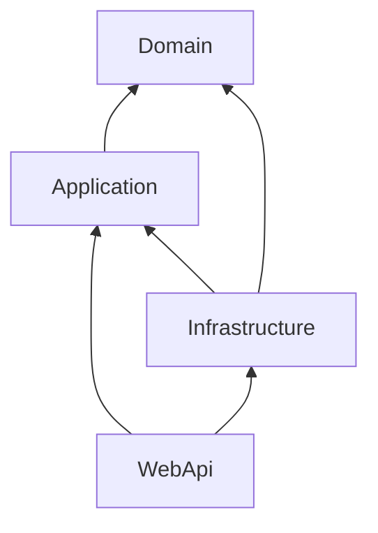

# Chapter 2: Tiêu chuẩn Kiến trúc Hướng tâm (Architectural Standard)

Tài liệu này quy định các nguyên tắc thiết kế cốt lõi và luồng dữ liệu bắt buộc trong dự án Travel App. Bất kỳ mã nguồn nào vi phạm sơ đồ này sẽ bị coi là **Kiến trúc lỗi**.

---

## 1. Bản đồ Phụ thuộc (The Dependency Map)

Kiến trúc của dự án được xây dựng theo mô hình **Onion Architecture** với các tầng phụ thuộc một chiều:

### Quy tắc bất biến (Immutability Rules):
1.  **Lõi (Domain):** Tuyệt đối không được chứa mã liên quan đến Database, Framework hoặc UI.
2.  **Lớp Application:** Chỉ chứa các Interface (Trừu tượng) và Use Cases. Không chứa cài đặt chi tiết của hạ tầng.
3.  **Lớp Infrastructure:** Chỉ chứa mã cài đặt chi tiết (Implementation).

---

## 2. Tiêu chuẩn Phân lớp (Layering Standards)

| Tầng | Nội dung cho phép | Kiểm tra Audit |
| :--- | :--- | :--- |
| **Domain** | Entities, Value Objects, Enums, Exceptions chuyên biệt. | Không có `using Microsoft.EntityFrameworkCore`. |
| **Application** | DTOs, Handlers, Mappers, Interfaces. | Không có mã xử lý SQL hoặc gọi API bên ngoài. |
| **Infrastructure** | DbContext, Migrations, Repositories, API Clients. | Không có Business Logic phức tạp. |
| **WebApi** | Controllers, Startup, Middleware. | Không chứa logic tính toán nghiệp vụ. |

---

## 3. Danh sách kiểm tra Audit (Audit Checklist)

- [ ] **Check 1:** Có lớp nào ở tầng `Domain` sử dụng thư viện bên thứ ba (ngoài .NET Core cơ bản) không? (Nếu có -> **FAILED**).
- [ ] **Check 2:** Có hành động "Lưu vào Database" (`SaveChanges`) nào nằm ở tầng `Application` không? (Nếu có -> **PASSED** - Miễn là thông qua Interface).
- [ ] **Check 3:** WebApi có phụ thuộc trực tiếp vào các Entity của Domain không? (Nên dùng DTO - Nếu dùng Entity trực tiếp -> **WARNING**).

---

## 4. Nguyên tắc "Tách biệt mối quan tâm" (SoC)

Dự án bắt buộc phải tách biệt mã nguồn sao cho:
- Thay đổi giao diện (Vue.js sang React) không ảnh hưởng đến Application.
- Thay đổi Database (SQLite sang SQL Server) không ảnh hưởng đến Domain.

---

> [!CAUTION]
> Việc để tầng Application phụ thuộc vào WebApi là một lỗi kiến trúc nghiêm trọng (Circular Dependency). Hệ thống sẽ không thể biên dịch và sẽ bị yêu cầu làm lại toàn bộ.

[Tiếp theo: Tiêu chuẩn Tầng Domain & Thực thể](./Chapter 3 - Domain Layer & Entities.md)

---

## Tiếp theo: Chương 3 - Domain Layer & Entities
Chúng ta sẽ bắt đầu xây dựng lớp Lõi (Domain) cho ứng dụng.

[Bắt đầu Chương 3](./Chapter 3 - Domain Layer & Entities.md)
